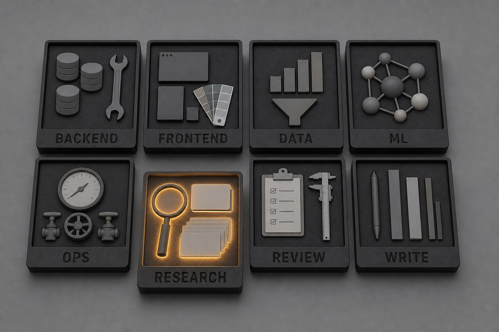

# claude-mode



Claude Code 를 감싸서 `claude --mode <name>` 을 쓸 수 있게 해주는 셸 함수입니다. **bash 와 zsh 를 모두 지원합니다.**

`--mode` 를 붙이면 `settings/settings.<name>.json` 을 그 세션에만 `--settings` 옵션으로 넘깁니다. 원래 설정 파일인 `~/.claude/settings.json` 은 건드리지 않습니다.

이 파일들은 **실행하는 게 아니라 `source` 로 읽어야 합니다.** `bash claude-mode.bash` 처럼 직접 실행하면 함수가 그 자리에서만 잠깐 생겼다 사라져서 아무 일도 일어나지 않습니다.

| 셸 | 파일 |
|----|------|
| zsh | `claude-mode.zsh` |
| bash | `claude-mode.bash` |

## 설치방법

```bash
curl -fsSL https://raw.githubusercontent.com/Mineru98/claude-mode/refs/heads/main/install.sh | sh
```

어느 셸에서나 도는 `sh` 스크립트라서 oh-my-zsh 를 안 써도 되고 zsh 를 안 써도 됩니다. 하는 일은 이렇습니다.

1. `jq` / `git` 또는 `curl` / `bash` 또는 `zsh` 가 있는지 확인합니다. 없으면 OS 에 맞는 설치 명령을 알려주고 멈춥니다. `claude` 가 없으면 경고만 하고 계속합니다.
2. 저장소를 `~/.claude-mode` 로 받습니다. `git` 이 없으면 압축 파일을 내려받아 풉니다. 이미 있으면 그 자리에서 업데이트합니다.
3. 쓰는 셸에 맞춰 `~/.zshrc` / `~/.bashrc` 끝에 claude-mode 전용 구간을 넣습니다. 이 두 파일은 터미널을 열 때마다 자동으로 읽히는 설정 파일이고, 아래에서는 줄여서 **rc 파일**이라고 부릅니다. 처음 넣을 때 `<rc>.claude-mode.bak` 백업을 남깁니다.

같은 명령을 다시 돌리면 최신으로 업데이트하고 그 구간을 갱신합니다. 여러 번 돌려도 중복해서 쌓이지 않습니다.

### 설치 옵션

환경변수로 바꿉니다.

```bash
# 다른 경로에 설치
curl -fsSL .../install.sh | CLAUDE_MODE_HOME="$HOME/dev/claude-mode" sh

# rc 파일을 건드리지 말고, 넣을 내용만 화면에 출력
curl -fsSL .../install.sh | CLAUDE_MODE_SHELL=none sh

# bash 와 zsh 양쪽 rc 파일에 모두 넣기
curl -fsSL .../install.sh | CLAUDE_MODE_SHELL=both sh
```

| 변수 | 기본값 | 뜻 |
|------|--------|-----|
| `CLAUDE_MODE_HOME` | `~/.claude-mode` | 설치 경로 |
| `CLAUDE_MODE_SHELL` | `auto` | rc 파일을 고칠 셸: `auto` / `bash` / `zsh` / `both` / `none` |
| `CLAUDE_MODE_REF` | `main` | 받을 branch / tag |
| `CLAUDE_MODE_REPO` | GitHub 저장소 | 다른 fork 를 쓸 때 |

`auto` 는 지금 쓰는 셸(`$SHELL`)을 먼저 봅니다. 다른 셸의 rc 파일이 이미 있으면 거기도 같이 넣습니다. macOS 에서 `~/.bash_profile` 이 `~/.bashrc` 를 안 읽고 있으면 `~/.bash_profile` 에도 넣습니다.

### 설치 확인

```bash
claude --mode
```

모드 목록이 뜨면 설치가 끝났습니다. 안 뜨면 새 터미널 탭을 열어보세요.

`claude` 가 함수가 아니라 실행 파일로 잡히면 rc 파일의 claude-mode 구간이 아직 안 읽힌 것입니다.

```bash
type claude    # bash
whence -v cc   # zsh
```

### 지우기

rc 파일에서 `# >>> claude-mode >>>` 부터 `# <<< claude-mode <<<` 까지를 지우고, 설치 경로를 삭제합니다.

```bash
rm -rf ~/.claude-mode
```

## 필요 조건

- bash 또는 zsh
- [Claude Code CLI](https://docs.anthropic.com/en/docs/claude-code) (`claude` 명령을 터미널에서 바로 쓸 수 있어야 함)
- [jq](https://jqlang.github.io/jq/) — JSON 을 다루는 도구입니다. 모드 설정과 `settings.local.json` 을 합칠 때 씁니다
- 설치 스크립트를 쓴다면 `git` 또는 `curl`

확인:

```bash
command -v claude
command -v jq
```

## 직접 설치하기

설치 스크립트를 안 쓰고 손으로 넣는 방법입니다.

```bash
git clone https://github.com/Mineru98/claude-mode.git ~/.claude-mode
```

`~/.bashrc` 또는 `~/.zshrc` 끝에 아래를 넣습니다. 두 셸 모두에서 그대로 동작합니다.

```bash
CLAUDE_MODE_HOME="$HOME/.claude-mode"
if [ -n "${ZSH_VERSION-}" ] && [ -f "$CLAUDE_MODE_HOME/claude-mode.zsh" ]; then
  . "$CLAUDE_MODE_HOME/claude-mode.zsh"
elif [ -n "${BASH_VERSION-}" ] && [ -f "$CLAUDE_MODE_HOME/claude-mode.bash" ]; then
  . "$CLAUDE_MODE_HOME/claude-mode.bash"
fi
```

### oh-my-zsh 를 쓴다면

`source $ZSH/oh-my-zsh.sh` **뒤에** 두어야 합니다. 앞에 두면 oh-my-zsh 플러그인이 나중에 만드는 `claude` 별칭에 덮어써집니다.

이미 `claude` 나 `cc` 를 만드는 다른 스크립트를 읽고 있다면 **나중에 읽은 쪽이 이깁니다.** 둘을 같이 쓰지 마세요.

`cc` 는 `claude` 와 똑같이 동작하는 짧은 이름입니다. `claude` 만 쓰고 싶으면 읽어들인 다음 `unset -f cc` (bash) 또는 `unfunction cc` (zsh) 를 넣으면 됩니다.

### 적용

새 터미널 탭을 여는 편이 가장 안전합니다. 이미 열린 터미널에 바로 적용하려면 `. ~/.bashrc` 또는 `source ~/.zshrc` 를 씁니다.

Powerlevel10k 의 instant prompt 를 쓰면 이미 떠 있는 zsh 에서 `source ~/.zshrc` 할 때 화면 출력과 관련된 경고가 날 수 있습니다. 그 경우 새 탭을 쓰세요.

## 사용

```text
claude --mode                        모드 목록
claude --mode default                default 설정으로 실행
claude --mode research --resume      모드 + Claude Code 옵션
claude --mode=ui                     등호 형태
cc --mode slide                      claude 와 동일
```

`--mode` 는 래퍼가 직접 처리하고 Claude Code 로 넘기지 않습니다. 나머지 옵션은 그대로 Claude Code 로 넘어갑니다. `--mode` 가 없으면 아무것도 손대지 않고 원래 `claude` 명령을 그대로 실행합니다.

명령에 `--settings` 를 이미 직접 붙였으면 모드 설정 파일은 건너뜁니다. `settings/mcp.<name>.json` 이 있으면 `--mcp-config` 로 함께 붙이고, `--mcp-config` 도 직접 붙였으면 마찬가지로 건너뜁니다.

## 모드 파일이 하는 일

모드 JSON 은 Claude Code 세션 설정입니다. 보통 다음을 넣습니다.

- `enabledPlugins` — 쓰지 않는 플러그인은 `false`
- `skillOverrides` — 쓰지 않는 스킬 이름은 `"off"`
- `deniedMcpServers` — 이 모드에서 막을 MCP 서버. MCP 서버는 Claude Code 가 붙어서 쓰는 외부 도구입니다

`skillOverrides` 로는 플러그인이 들고 온 스킬을 끄지 못합니다. 그건 `enabledPlugins` 에서 플러그인 자체를 꺼야 합니다.

`~/.claude/settings.local.json` 에 `skillOverrides` 가 있으면 모드 파일과 합쳐서 씁니다. 같은 항목이 양쪽에 있으면 모드 파일이 이깁니다.

MCP 서버를 어디에 어떻게 붙일지는 `~/.claude.json` 에 적혀 있습니다. 한 모드에서만 서버를 더 붙이고 싶으면 `settings/mcp.<name>.json` 을 만들어 두면 됩니다.

## 들어 있는 모드

| 이름 | 쓰임새 | 켜는 플러그인 |
|------|----------|----------------|
| `backend` | TypeScript 백엔드 개발자 | typescript-lsp, serena, context7, prisma, postman, commit-commands |
| `data-eng` | 데이터 엔지니어 | data-engineering, duckdb-skills, mongodb, context7, commit-commands |
| `data-science` | 데이터 분석가 | pyright-lsp, duckdb-skills, bigquery-data-analytics, context7, claude-md-management |
| `default` | 기본값 (플러그인 지정 없음) | — |
| `frontend` | TypeScript + React 프론트엔드 개발자 | typescript-lsp, frontend-design, modern-web-guidance, chrome-devtools-mcp, context7, commit-commands |
| `ml` | ML / 모델 엔지니어 | pyright-lsp, huggingface-skills, mlflow, duckdb-skills, context7 |
| `n8n` | n8n 워크플로 작업 | ui-ux-pro-max |
| `ops` | 배포 / 운영 | github, vercel, sentry, postman, commit-commands |
| `research` | 연구자 | exa, tavily, firecrawl, context7, notion |
| `review` | 코드 리뷰어 | code-review, pr-review-toolkit, code-simplifier, security-guidance, github |
| `slide` | 프레젠테이션 디자이너 | frontend-slides, ui-ux-pro-max, frontend-design, canva |
| `study` | 학습자 | learn-with-coursera, explanatory-output-style, math-olympiad, context7 |
| `ui` | 웹 + 모션 디자이너 | frontend-design, superdesign, figma, chrome-devtools-mcp, modern-web-guidance, ui-ux-pro-max |
| `write` | 문서 작성가 | notion, mintlify, exa, ckeditor, claude-md-management |

각 모드 파일은 `settings/settings.<name>.json` 입니다. 플러그인을 많이 켤수록 Claude 가 읽어야 할 설명이 늘어나기 때문에, 모드당 4~6개로 제한했습니다. 각 파일 `enabledPlugins` 아래쪽에는 그 쓰임새에서 다음으로 켤 만한 후보를 `false` 로 적어 두었으니 필요하면 값만 `true` 로 바꾸면 됩니다.

## 모드 추가

`settings/settings.<name>.json` 을 만들면 됩니다. 이름은 영문·숫자로 시작하고 그 뒤에 영문·숫자·`_`·`-` 만 쓸 수 있습니다(`[A-Za-z0-9][A-Za-z0-9_-]*`). 파일만 두면 bash / zsh 양쪽에서 알아서 목록에 잡힙니다.

```json
{
  "$schema": "https://json.schemastore.org/claude-code-settings.json",
  "enabledPlugins": {},
  "skillOverrides": {}
}
```
